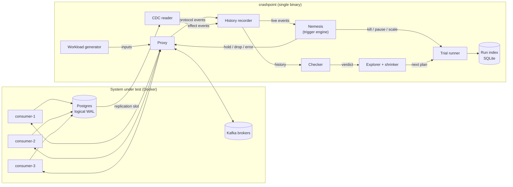
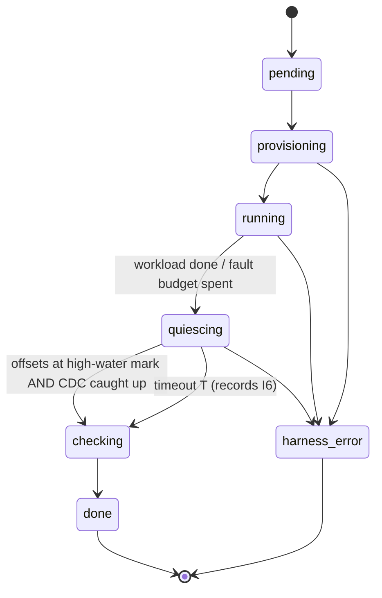
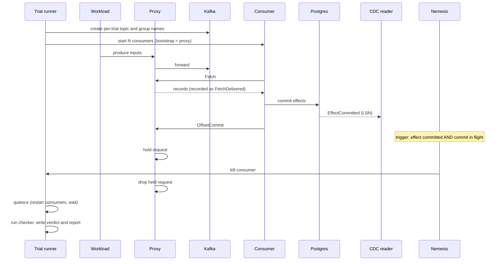

# Crashpoint Architecture

**Version:** 0.1 (draft) · **Status:** Proposed

This document describes how Crashpoint is built. For *what* it checks and why, see [DESIGN.md](DESIGN.md). For the reasoning behind major choices, see the [ADRs](adr/).

---

## 1. Overview

Crashpoint is a **single Go binary** that runs trials against a system under test (SUT) running in Docker.



The SUT is the distributed system; the tool deliberately is not. Distribution appears only where it clearly pays off: parallel trial runners (Section 9).

---

## 2. Components

### 2.1 Proxy (data plane)

**Responsibility:** forward all Kafka traffic transparently, record protocol events, and execute proxy-level faults.

- **Listeners:** one bootstrap listener plus one listener per broker node, created when the node first appears in a response.
- **Address rewriting:** Metadata, FindCoordinator, and DescribeCluster responses are rewritten so clients only ever learn proxy addresses. Without this, clients bypass the proxy after bootstrapping.
- **Correlation tracking:** response headers carry only a correlation ID. The proxy keeps a per-connection map from correlation ID to (API key, version), registered before forwarding each request. Produce requests with `acks=0` get no response and must not be registered.
- **Header versions:** flexible API versions add tagged fields to headers. The ApiVersions response always uses the old header format.
- **Fast path:** frames for APIs Crashpoint doesn't inspect are forwarded without decoding their bodies.
- **Slow path:** about 12 APIs are decoded: Fetch, OffsetCommit, OffsetFetch, JoinGroup, SyncGroup, Heartbeat, LeaveGroup, ConsumerGroupHeartbeat, Produce, Metadata, FindCoordinator, ListOffsets.
- **Fetch handling:** read only record-batch headers (base offset, last offset delta), never decompress records. Clamp delivered ranges to the requested fetch offset, because brokers return whole batches that may start earlier.
- **Fault actions:** `observe`, `delay`, `hold`, `drop_request`, `drop_response`, `inject_error`.
- **Connection classification:** every accepted connection is tagged `sut` or `harness` (by client ID prefix and listener). Faults may target only `sut` connections, so Crashpoint can never fault its own workload and corrupt the ground truth.
- **Refusal detection:** transactional APIs, share-group APIs, and the absence of group protocol traffic end the trial as `UNSUPPORTED` (DESIGN.md Section 8).

### 2.2 Workload generator

**Responsibility:** produce inputs with unique `event_id`, key, and per-key `seq`, and record each input's status (acknowledged / failed / indeterminate) with its partition and offset.

Two modes (DESIGN.md Section 4). **Generated mode** (v1) produces records through a pluggable `PayloadEncoder`; v1 ships JSON. **Observed mode** (v2) derives inputs from the SUT's own Produce requests using an `IdentityExtractor` (record header or JSON path). The checker depends only on the `Input` interface, never on which mode supplied it — this interface boundary exists in v1 even though only generated mode ships.

### 2.3 CDC reader

**Responsibility:** read committed effect rows from a Postgres logical replication slot on a publication covering the effects table. It emits effect events with commit LSN, `event_id`, key, `seq`, and consumer ID.

### 2.4 History recorder

**Responsibility:** normalize events from all sources into typed operations, append them to a per-trial log, and stream them to the nemesis.

| Operation | Source | Key fields |
|---|---|---|
| `InputRecorded` | Workload | event_id, key, seq, status, partition, offset |
| `FetchDelivered` | Proxy | member, partition, first_offset, last_offset |
| `CommitRequested` / `CommitResult` | Proxy | member, epoch, partition, offset, error |
| `AssignmentChanged` | Proxy | member, epoch, partitions |
| `EffectCommitted` | CDC | lsn, tx_position, event_id, key, seq, writer_id (fields present depend on tier) |
| `FaultApplied` | Nemesis | fault_id, action, target |

Every operation carries a source-local sequence number and a monotonic receive timestamp. Timestamps are for display only; the checker never uses them for cross-source ordering.

### 2.5 Nemesis (trigger engine)

**Responsibility:** evaluate fault-plan predicates incrementally against the live event stream, and execute actions through the proxy (network faults) or the trial runner (process faults).

**Speculative holding** (ADR-0007): when a crash-window trigger is armed, every OffsetCommit on the targeted partition is held for a bounded budget (default 10 ms) while the nemesis waits for the corresponding CDC event, then fires or releases. It maintains `windows_armed` and `windows_hit` counters.

### 2.6 Checker

**Responsibility:** after quiescence, evaluate the invariants in DESIGN.md over a trial history and produce a verdict with minimal evidence.

**Algorithm outline:**

1. Resolve the **tier** from the schema mapping and enable the supported invariants (DESIGN.md Section 3).
2. Build the input set, deduplicated by `event_id`.
3. Build per-partition ownership intervals from `AssignmentChanged` operations.
4. Join `EffectCommitted` operations to inputs by `event_id` (T1+), ordering within a transaction by stream position (I3 tie-break).
5. Evaluate the enabled invariants from I1–I7.
6. For each violation, extract the minimal history slice: operations touching the affected inputs and partitions. For a duplicate at T1/T2, attach overlapping ownership evidence when present.

It must run in a single streaming pass per partition, with memory proportional to active state, not total history.

### 2.7 Explorer and shrinker

- **Explorer:** generates fault plans from a seed, using "swarm testing": each trial enables a random subset of fault types.
- **Shrinker:** on failure, applies delta debugging (ddmin) in stages: fault list → workload size → partitions and consumer count. Candidates run in parallel. A candidate counts as "still failing" per the replay rule in DESIGN.md Q5.

### 2.8 Trial runner

**Responsibility:** provision isolated trial environments, run trials, reap resources, and persist trial state.

### 2.9 Report

A static HTML file per trial: swimlanes per member showing ownership intervals, deliveries, commits, effects, and faults, with violations highlighted. No web server.

---

## 3. Trial lifecycle



Each trial holds a **lease** in SQLite that is renewed by a heartbeat. If Crashpoint crashes, trials with expired leases become `harness_error`, and the reaper removes their containers, topics, consumer groups, and replication slots.

---

## 4. A trial, step by step



---

## 5. Concurrency model

| Area | Model | Rationale |
|---|---|---|
| Proxy connections | Two goroutines per client connection (requests, responses) | Kafka connections are long-lived and ordered |
| In-flight map | Per-connection, mutex-protected | Registered before forwarding, removed on response |
| Response ordering | Preserved strictly per connection | Required by the protocol; the source of hold head-of-line blocking (DESIGN 7.4) |
| Recorder | Bounded channel to one writer goroutine | Recording must not stall the proxy; overflow makes the trial a `harness_error` |
| Nemesis | One goroutine consuming the event stream | Deterministic predicate evaluation order |
| Trials | Bounded worker pool | Throughput limited by containers, not CPU |

**Memory budgets:** held frames have a byte limit per trial; the recorder has a bounded buffer. Exceeding either invalidates the trial rather than silently changing its behavior.

---

## 6. Storage

Fault plans carry a `version` field from the first release; the compatibility policy is that Crashpoint reads plans written by any earlier v0.x and refuses, with a clear message, any plan whose version it does not know.

| Data | Format | Location |
|---|---|---|
| Trial history | Append-only, length-prefixed binary records | `crashpoint-out/<trial>/history.cpb` |
| Fault plan | JSON | `crashpoint-out/<trial>/plan.json` |
| Report | Static HTML | `crashpoint-out/<trial>/report.html` |
| Runs, trials, seeds, verdicts, leases | SQLite | `crashpoint-out/index.db` |

In Week 1, the recorder may write JSON Lines for easy inspection with `jq`; the binary format replaces it in Week 2.

---

## 7. Interfaces

### CLI (planned)

```text
crashpoint proxy     transparent proxy with recording (Week 1)
crashpoint run       run one fault plan (Week 3)
crashpoint explore   generate and run trials within a budget (Week 5)
crashpoint shrink    minimize a failing trial (Week 7)
crashpoint replay    replay a plan N times, report reproduction rate (Week 7)
crashpoint report    render the HTML report for a trial (Week 4)
crashpoint bench     run the benchmark suite (Week 6)
```

### Configuration file (sketch)

```yaml
sut:
  compose: ./docker-compose.yaml
  consumers: { service: payments-consumer, replicas: 3 }
kafka:
  input_topic: payments.requested
  group: payments
  protocol: [classic, consumer]
effects:
  postgres:
    dsn: postgres://crashpoint@db/app
    table: ledger_entries
    columns: { event_id: source_event_id, key: account_id, seq: source_seq, consumer: consumer_id }
invariants: [no_lost_effects, at_most_once_effect, per_key_order, no_zombie_writes, commit_not_ahead_of_effect, liveness]
quiescence: { timeout: 60s }
explore: { budget: 30m, parallel_trials: 4 }
```

---

## 8. Planned repository layout

```text
crashpoint/
├── cmd/crashpoint/          CLI entrypoint
├── internal/
│   ├── proxy/               framing, headers, rewriting, fault actions
│   ├── protocol/            partial decoders (fetch batch headers, group protocols)
│   ├── history/             operation types, log writer/reader
│   ├── cdc/                 Postgres logical replication reader
│   ├── workload/            input generator
│   ├── nemesis/             plan model, predicates, action execution
│   ├── checker/             tiers, invariants, evidence extraction
│   ├── explore/             plan generation and shrinking
│   ├── runner/              Docker orchestration, leases, reaper
│   └── report/              HTML timeline
├── sut/                     reference payments consumer + bug modes (separate Go module)
├── bench/                   benchmark scripts and raw results
└── docs/
```

The reference SUT is a **separate Go module** so its dependencies (database driver, Kafka client) don't leak into the tool.

---

## 9. Scaling path

| Stage | Setup | When |
|---|---|---|
| v0.1 | Local worker pool; shared broker per runner for proxy/process faults | Weeks 1–8 |
| v0.2 | Dedicated broker per trial for broker-level faults | When `broker_restart` ships |
| v1.x | Runners as Kubernetes Jobs with pre-warmed, resettable broker pools; histories in object storage | Only if trial throughput demands it |

---

## 10. Observability of Crashpoint itself

- **Prometheus metrics:** frames by API and direction, proxy-added latency histogram, decode time, held bytes and frames, active connections, recorder lag, trigger evaluation time, trials by verdict, harness errors by cause.
- **`pprof`** enabled for profiling during benchmarks.
- **Structured JSON logs** tagged with `trial_id` and `seed`.

---

## 11. Failure handling rules

| Situation | Handling |
|---|---|
| Crashpoint crashes mid-trial | Lease expires → `harness_error`; reaper cleans up |
| CDC slot breaks or lags past a limit | `harness_error` (history incomplete) |
| Recorder buffer overflows | `harness_error` |
| Held-frame memory budget exceeded | `harness_error` |
| Unplanned proxy→broker latency spike | `NOISY`; excluded from statistics |
| Trial runner dies | Container labels + lease let the reaper clean up; per-trial group names stop orphans from joining later trials |
| SUT database unavailable (not injected) | Recorded as observed SUT behavior; `harness_error` only if CDC is affected |

---

## 12. Testing strategy

Crashpoint is a correctness tool, so its own correctness needs more testing than a typical application.

| Layer | Approach |
|---|---|
| Harness safety | A test asserts that no fault can target a connection classified `harness` |
| Refusals | Tests that a transactional client and a manually-assigning client each produce `UNSUPPORTED` |
| Tiers | The corpus runs at T0, T1, and T3; each tier enables exactly the documented invariants |
| Protocol parsing | Unit tests per API/version, round-trip encode/decode, **fuzz tests for every parser** |
| Proxy | End-to-end tests with a real client through the proxy against franz-go's in-memory `kfake` cluster, asserting no traffic bypasses the proxy |
| Checker | Hand-written histories with known violations; property tests generating valid histories that must pass; a brute-force reference checker on small histories for cross-checking |
| Nemesis | Predicate tests on recorded event streams |
| Whole system | Seeded bug corpus (detection rate) and the control consumer across hundreds of trials (false-positive rate) |
| Regression | Every real bug found in Crashpoint gets a history-based test |
| CI | Vet, race-detector tests, short fuzz runs on every push; control trials nightly |
